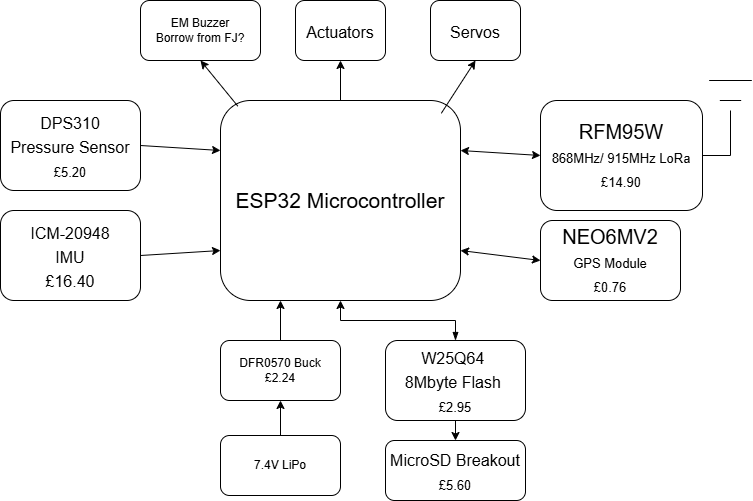

# Flight Computer

This repository contains code and documentation related to the [NAME HERE] flight computer. The flight computer is currently built using breakouts for simplicity and cost-effectiveness, but will later be updated. 

## Parts
- ESP32 Microcontroller
- DPS310 Pressure Sensor
- RFM95W LoRa radio
- NEO6M72 GPS Module
- W25Q64 Flash
- MicroSD breakout
- ICM-20948 IMU
- DFR0570 Buck

## Block Diagram

